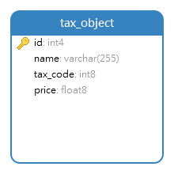

# Tax-Calculator Application

This repository contains the tax-calculator application. 
It can create tax data and calculate the bill based on the tax data. 
This application only serves as the JSON API for the front-end engineers
so they can build their application.

# Table of Contents


- [Tax-Calculator Application](#tax-calculator-application)
- [Table of Contents](#table-of-contents)
- [Requirements](#requirements)
- [Architecture](#architecture)
- [Deployment](#deployment)
- [Documentation](#documentation)
  - [API Documentation](#api-documentation)
  - [Database Documentation](#database-documentation)
- [User Dashboard](#user-dashboard)
- [Additional Note](#additional-note)
- [References](#references)
- [License](#license)


# Requirements


The requirements to start this application are as below:
1. Internet Connection
2. Docker
3. Docker Machine (optional)

# Architecture


This application was built by using these following stacks (technologies) and concepts:
1. Go Language (v1.10.4)
2. Echo web framework (v4.0.0)
3. Domain Driven Design (DDD)
4. Testify Assert (Testing)
5. JSON API
6. PostgreSQL

# Deployment

---

To start the application, we only need to run the command below.
```
docker-compose up
```
We can start the application using another approach like this.
```
docker-compose up -d; docker-compose logs -f
```

# Documentation

The documentation for this application is divided into two sections. 
The first section is about API Documentation and the second section is about Database Documentation.

## API Documentation

API Documentation explains how front-end engineers can use this application to build
the front-end app. 
This section documents the application's action and responses based on the request.
API Documentation conforms to the OpenApi Specification v2.0 (OAS).
This documentation can be found in this [link](http://localhost:8080/doc).
This section also includes [postman](https://documenter.getpostman.com/view/3751209/S11LsHwy) documentation for the simple and helpful tool for front-end engineers.

## Database Documentation

Database Documentation explains the structure of the database used by this application.
The database structure can be found in the picture below.



The documentation shows a table with the name 'tax_object'.
The table has four fields, i.e. id, name, tax_code, price. 
The 'id' field is the primary key of the table and serves as the unique identifier of the tax object.
This field's value is generated automatically by the database. 
The 'name' field is used to identify the name of the tax object.
This field has the string type (varchar).
The 'tax_code' specifies the tax code for the tax object.
This field has the integer type (int).
The 'price' field is used to store the price of the tax object.
This field has the number type (float).

# User Dashboard

The User Dashboard shows the front part of the application. 
The User Dashboard can be accessed in this [link](http://localhost:8080/).

# Additional Note

All links that refer to [localhost]() should be changed if we use docker machine to start the application. 
Getting the docker machine IP address could be accomplished by using this command below.

```
docker-machine env {your_machine_name} | grep DOCKER_HOST
```

The `{your_machine_name}` should be substituted by the machine's name in your docker.

# References

The references used for developing this application are listed below:

- [Go Clean Architecture](https://github.com/bxcodec/go-clean-arch)
- [Go Standard Project Layout](https://github.com/golang-standards/project-layout)

# License

MIT License


